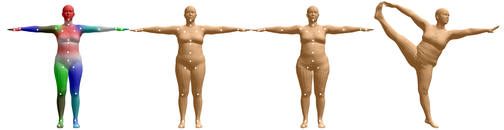
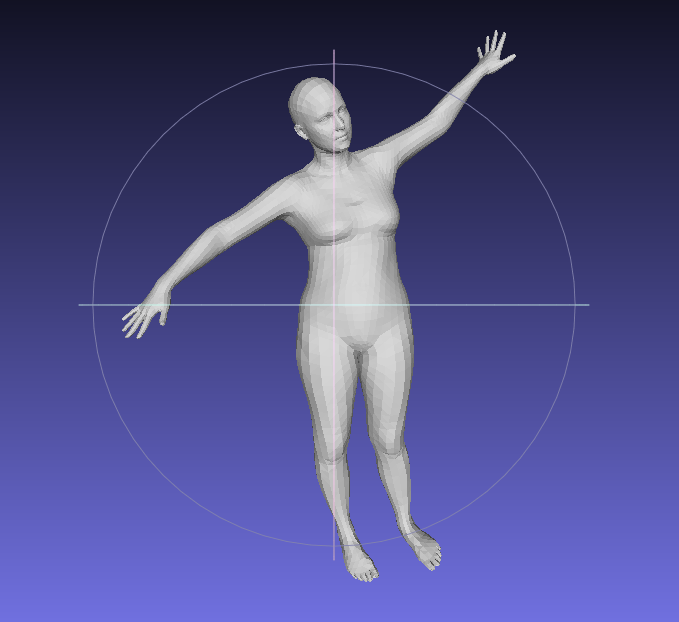

A C++ Implementation of SMPL - A Skinned Multi-Person Linear Model.

## Overview

This project implements a 3D human skinning model - SMPL: A Skinned
Multi-Person Linear Model with C++. The official SMPL model is available at http://smpl.is.tue.mpg.de.

The author-provided implementation based on *Chumpy* and *OpenDR* contains spaghetti code, and it cannot run on GPUs yet. I convert and update another Tensorflow 
version of SMPL contributed by [CalciferZh](https://github.com/CalciferZh) to 
C++ style.
You can find the Tensorflow implementation 
[here](https://github.com/CalciferZh/SMPL).
However, Tensorflow C++ APIs are not user-friendly, so I choose the Pytorch 
C++ APIs - libTorch - instead.

For more details, see the [paper](http://files.is.tue.mpg.de/black/papers/SMPL2015.pdf) 
published by Max Planck Institute for Intelligent Systems on SIGGRAPH ASIA 
2015.

## Prerequisites

I have tested the codes on my machine, but I'm not sure the performance on other environments.

- GPU

  NVIDIA GeForce GTX 960M

- OS

  Ubuntu 18.04 LTS

- Packages

1. [xtensor](https://github.com/QuantStack/xtensor): A C++ library meant for numerical analysis with multi-dimensional array expressions. 
  
    A C++ interpretation of *Numpy*, you can even find functions with similar names in it. A [cheat sheet (https://xtensor.readthedocs.io/en/latest/) from *Numpy* to *Xtensor* is helpful.

    Currently, I only use *Xtensor* as an IO interface for module testing with random inputs and restoring hyperparameters in JSON format. Share the buffer of an *Xtensor* array with a corresponding *PyTorch* tensor is straightforward.

2. [nlohmann_json](https://github.com/nlohmann/json): JSON for Modern C++.

    *Xtensor* loads data from and dumps data into JSONs through nlohmann's toolkit.

3. [libTorch](https://pytorch.org/get-started/locally/): Pytorch C++ API.

    PyTorch C++ API simplifies tensor computing and introduces GPU 
    acceleration to this work, using CUDA and cuDNN.

    Note: I installed the nightly version of *libTorch* with CUDA 10.0 support.

4. [CUDA](https://developer.nvidia.com/cuda-downloads): NVIDIA parallel 
   computing platform.
  
    CUDA 10.0 works on my machine, besides I think the other versions fit the *libTorch* download list should work as well.

5. [CMake](https://cmake.org/download/): A tool to build, test and pack up 
   C++ program.
  
    The CMake installed by `apt-get` is CMake 3.5.1 which causes a 
    failure when *libTorch* tries to find CUDA. A description of the issue: https://discuss.pytorch.org/t/install-libtorch-error-pytorch-c-api/26756/2
  
    You should update it to a newer version, such as 3.13.4 (>=3.12.2 should work). Delete the old CMake completely, download the latest official source codes, and build it from scratch.

## Usage

- Package Installation

  Here are procedures to install packages into the root directory correctly. If you want to link libraries manually, skip this part and install the following packages in the usual ways — official documentation and Google helps a lot.

  - Source Code

    Compile libraries and headers into the root directory, e.g., *Xtensor*:

  1. create a directory in the Xtensor repo you have just cloned from Github to build the package.

          cd <xtensor-dir>
          mkdir build
          cd build

  2. configure CMake and generate Makefiles. Remember to redirect the
     installation directory to the root.

          cmake -D CMAKE_INSTALL_PREFIX=/usr/local ..

      The "/usr/local" can be replaced with any other locations as long as CMake can find the package automatically.

  3. compile and install.

          make -j#X#
          sudo make install

     `#X#` is the number of threads specified by yourself.

  - Binary Library
    
    Move pre-built packages into the root directory, e.g., *libTorch*:

  1. redirect into the *libTorch* directory.

          cd <libTorch-dir>

  2. copy *CMake* configurations to the "lib" directory.

          cp -rv share/cmake lib

  3. copy headers and libraries to the root directory.

          cp -rv include lib /usr/local

      Afterward, you won't need to specify the path to the *libTorch* library manually whenever building `libTorch`-dependent projects with *CMake*. The operations are a little bit different from the official guidance.

- Data preprocessing

  Download and extract the official data from http://smpl.is.tue.mpg.de/, you
  will get two files:
    
      basicModel_f_lbs_10_207_0_v1.0.0.pkl
      basicmodel_m_lbs_10_207_0_v1.0.0.pkl

  Run `preprocess.py` in [SMPL/scripts](SMPL++/scripts/preprocess.py) with Python 2 to convert the data into `.json` and `. npz` format. If you change the location of these data, remember to edit the `main.cpp` as well since I have hardcoded the paths.

  **Note**: If you have a strange mesh visualization, remember to double-check the face indices. (MeshLab favors the face indices starting from 1. However, this rule may not be compatible with other software.)

- Build and Run

  After installing all packages, you can compile SMPL++ from source:

      mkdir build
      cd build
      cmake ..
      make

  These commands produce an executable program named as "smplpp". To run it, just type

      ./smplpp
  
  in the terminal.

  To track the usage of GPUs, use the following command:

      nvidia-smi -lms

## Instructions

The project is simply a raw framework for SMPL++. I have written many comments in the source codes, but there may be some typoes. Sorry about that.

- Forward Propagation

  SMPL++ implements a part of the algorithm described in the paper. The inputs of the system are shape coefficients \beta, pose axis-angle parameterization \theta, and body translation \vec{t}. Each of them controls a trait of the body mesh.

  

  Note: Backward propagation has not been available yet.

- Render Meshes

  I don't have a GUI to render the output now! If you would like to see the 
  meshes, try to render them in [MeshLab](http://www.meshlab.net/).

- Pipeline

  Following the paper, we can generate a mesh with four steps.

  1. Generate pose blend shape and shape blend shape.

  2. Regress joints from vertices.

  3. Compute the transformation matrices for each joint.

  4. Linear Blend Skinning

- Kinematic Tree

  An kinematic tree for SMPL looks like this:

  

## TODO

- [x] Hyperparameters restore from `.npz` files instead of `.json` files. 
      (`.json` neither saves storage nor performances efficiently when being 
      imported.)

    **Update**: I have uploaded a script to convert data from official `.pkl`, check the fold SMPL++/scripts for more details.

- [ ] A OpenGL GUI to render and manipulate the 3D mesh.

- [ ] Fit the 3D mesh to a 2D image - SMPLify.

- [ ] Export SMPL++ into static or dynamic library.

- [ ] A trainable SMPL.

Note: The importance of each demand decreases in this list.

## Misc

If you find any problem, error, or even typo, feel free to contact me.

SMPL++ is for research purposes only. Any commercial usage should be allowed by original authors.

## Links
[1] Official Website of SMPL: http://smpl.is.tue.mpg.de.

[2] Official Website of SMPLify: http://smplify.is.tue.mpg.de.
